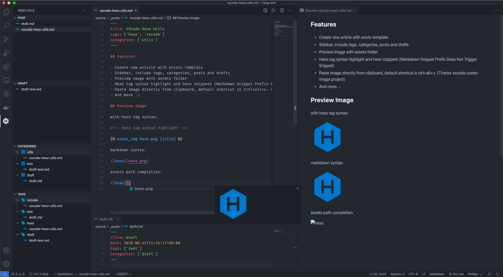
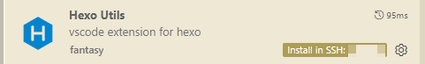

# VSCode Hexo Utils

Una barra lateral para el sistema de blogs [Hexo].

## Características

- Crear nuevos artículos con una plantilla existente.
- Barra lateral que incluye etiquetas, categorías, publicaciones y borradores.
- Gestionar etiquetas y categorías directamente desde la barra lateral:
  - **Añadir**: Añade una nueva etiqueta/categoría a todos los artículos listados actualmente bajo una etiqueta/categoría específica.
  - **Renombrar**: Renombra una etiqueta/categoría en todos los artículos de forma global.
  - **Eliminar**: Elimina una etiqueta/categoría de todos los artículos.
- Autocompletado de Front Matter para etiquetas y categorías (Gracias a [ruanimal]).
- Botones de acción rápidos de Front Matter (CodeLens) para seleccionar etiquetas, actualizar o insertar campos de fecha/actualización (Gracias a [ruanimal]).
- Previsualización de imágenes con carpeta de activos (assets).
- Resaltado de sintaxis de etiquetas de Hexo y snippets de Hexo.
- Pegar imágenes directamente desde el portapapeles, el atajo predeterminado es ctrl+alt+v. (Gracias al proyecto [vscode-paste-image]).
- Subir todas las imágenes locales del archivo actual; reemplazará la ruta local con la URL subida y mantendrá la ruta original como un comentario.
- Soporte para desarrollo remoto.
- Abrir automáticamente la previsualización lateral de Markdown al abrir una publicación de blog (Gracias a [ruanimal]).
- Botón de despliegue (Deploy) en la barra de título del editor para publicar tu blog con un solo clic (Gracias a [ruanimal]).
- Barra lateral de Tabla de Contenidos (TOC) de Markdown, con soporte para navegar/mover encabezados y numeración automática.
- Y mucho más...



## Configuración de la Extensión

- `hexo.sortMethod`: Controla el método de ordenación de publicaciones (borradores) y categorías (etiquetas), por defecto ordena por nombre.
- `hexo.hexoProjectRoot`: Ruta del proyecto `Hexo` (relativa a la raíz del espacio de trabajo actual), por defecto es la raíz del espacio de trabajo.
- `hexo.markdown.resource`: Controla si se resuelven las imágenes con la carpeta de recursos de Hexo, por defecto es `true`.
- `hexo.markdown.autoPreview`: Controla si se activa automáticamente la previsualización lateral de Markdown al abrir una publicación de blog, por defecto `false`.
- `hexo.upload`: Controla si se sube la imagen al usar el comando de pegar imagen.
- `hexo.uploadType`: Soporta `imgchr, tencentoss, custom`.
- `hexo.uploadImgchr`: Configuración de cuenta para el sitio `https://imgchr.com/`. Solo disponible cuando `hexo.upload` es `true`.
- `hexo.uploadTencentOSS`: Configuración de cuenta para el servicio Tencent OSS. Solo disponible cuando `hexo.upload` es `true`.
- `hexo.uploadCustom`: Configuración de servidor de subida personalizado. Solo disponible cuando `hexo.upload` es `true`.
- `hexo.generateTimeFormat`: El formato de tiempo al generar un nuevo artículo, por defecto es el formato ISO. ([time-format-tokens])
- `hexo.assetFolderType`: Tipo de carpeta para pegar imágenes. (si es `post`, pega la imagen en la carpeta del artículo actual, de lo contrario la imagen estará en la carpeta global `/sources/images/<__post>/`), ver [#89](https://github.com/0x-jerry/vscode-hexo-utils/pull/89)
- `hexo.deploy.command`: Comando de despliegue personalizado, por defecto `npx hexo deploy`. La variable de entorno `HEXO_ROOT` se establecerá en la ruta raíz del proyecto Hexo.
- `hexo.deploy.showButton`: Controla si se muestra el botón de despliegue en el título del editor, por defecto `false`.
- `hexo.toc.enableNumbering`: Habilita la numeración automática para el TOC, por defecto `false`.

### Ejemplo de Servidor de Subida Personalizado

Si deseas utilizar un servidor de subida personalizado, puedes configurarlo de la siguiente manera:

```json
{
  "hexo.uploadType": "custom",
  "hexo.uploadCustom": {
    "url": "https://xxxx.com/upload",
    "method": "POST",
    "fileKey": "file",
    "responseUrlKey": "data.url",
    "headers": {
      "Authorization": "Bearer your_token"
    },
    "extraFormData": {
      "account_id": "",
      "secret_access_key": ""
    }
  }
}
```

- `url`: El endpoint de la API para subir imágenes.
- `method`: Método HTTP, por defecto es `POST`.
- `fileKey`: El nombre de la clave form-data para el archivo, por defecto es `file`.
- `responseUrlKey`: La ruta hacia la URL de la imagen en el JSON de respuesta (ej. `url` o `data.url`).
- `headers`: Encabezados HTTP opcionales.
- `extraFormData`: Campos de form-data adicionales opcionales.

## Problemas Conocidos

Si has encontrado algún error, por favor abre un [issue](https://github.com/0x-jerry/vscode-hexo-utils/issues/new?assignees=&labels=&template=bug_report.md&title=)

## Preguntas y Respuestas (Q&A)

1. [El prefijo del Snippet de Markdown no activa el Snippet](https://github.com/Microsoft/vscode/issues/28048#issuecomment-306616235)

2. Si estás usando esta extensión para conectarte a un servidor remoto a través de SSH, deberás instalar esta extensión mediante `install in SSH:xxx` para ampliar las capacidades de renderizado de Markdown de VSCode.



3. Si has abierto múltiples carpetas en un mismo espacio de trabajo, debes establecer el proyecto Hexo como la primera carpeta abierta.

## Notas de Versión

Consulta las [releases](https://github.com/0x-jerry/vscode-hexo-utils/releases).

[hexo]: https://hexo.io
[vscode-paste-image]: https://github.com/mushanshitiancai/vscode-paste-image
[time-format-tokens]: https://day.js.org/docs/en/plugin/custom-parse-format#list-of-all-available-format-tokens
[abnernat]: https://github.com/abnernat
[ruanimal]: https://github.com/ruanimal

**¡Disfrútalo!**
