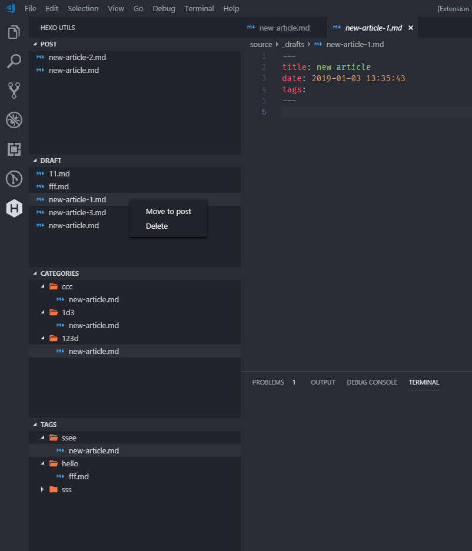
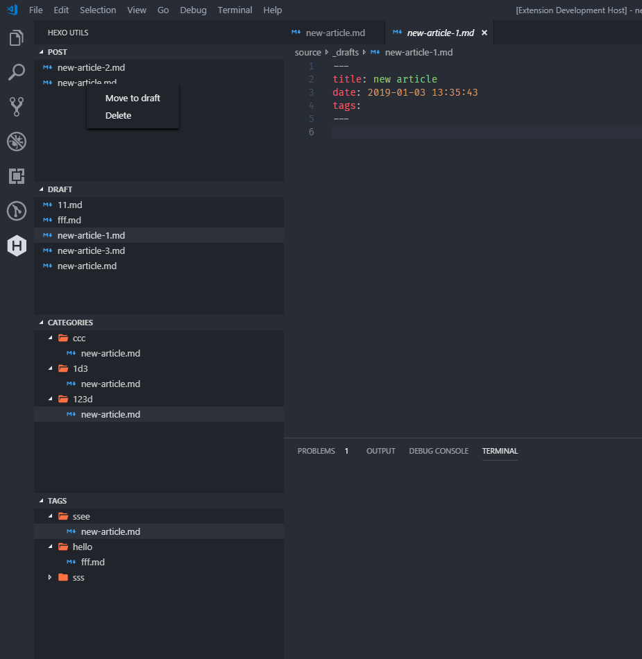
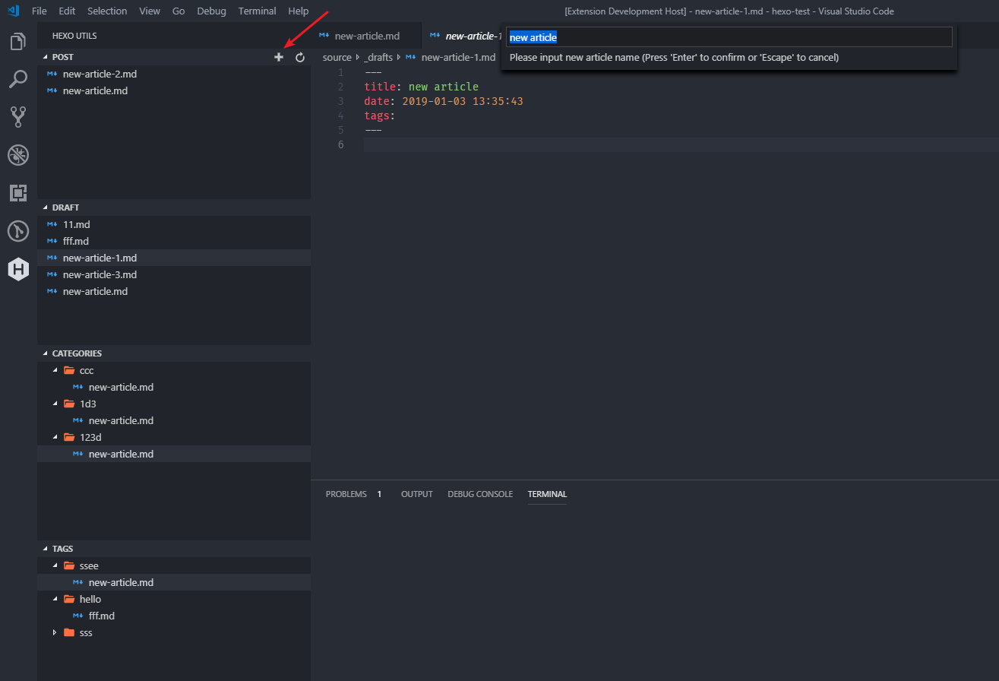

# vscode-hexo-utils README

A sidebar for [Hexo].

Open a [Hexo] project, and have fun.

## Features

## Extension Settings

- `hexo.packageManager`: The package manager used to run scripts, default yarn
- `hexo.includeDraft`: Controls whether include drafts, default false,

## Known Issues

[Bug report](https://github.com/cwxyz007/vscode-hexo-utils/issues)

## Need Feature

[Feature require](https://github.com/cwxyz007/vscode-hexo-utils/issues)

## Release Notes

See [CHANGELOG](CHANGELOG.md)

**Enjoy!**

[hexo]: https://hexo.io
