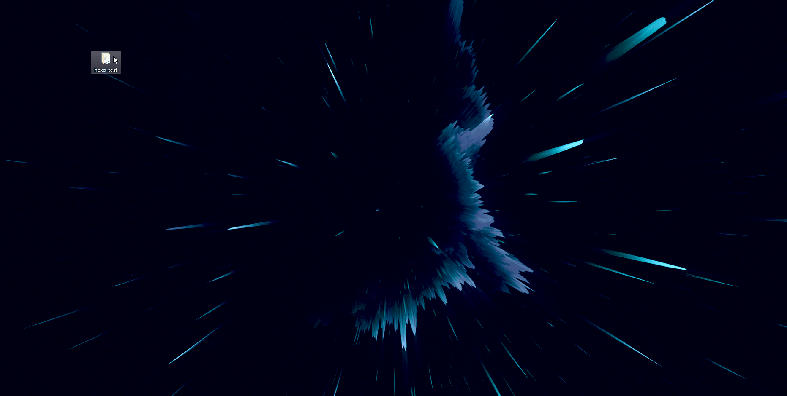
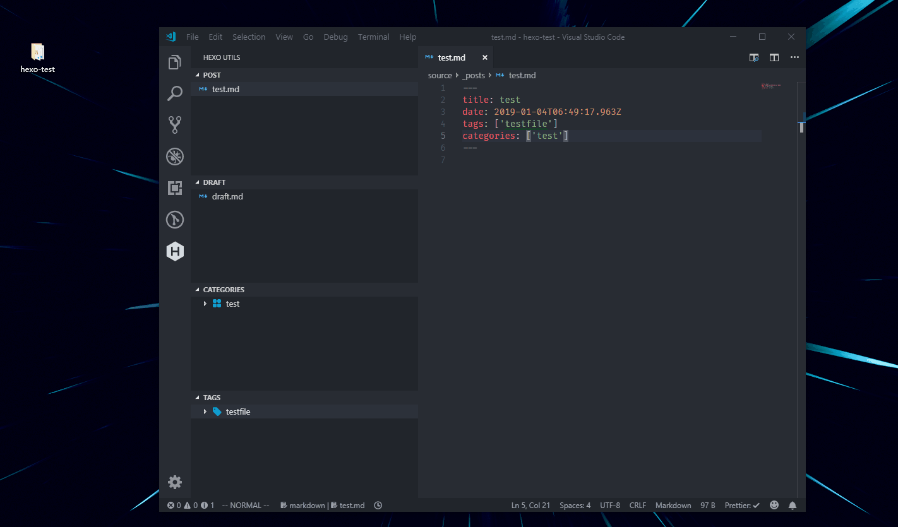
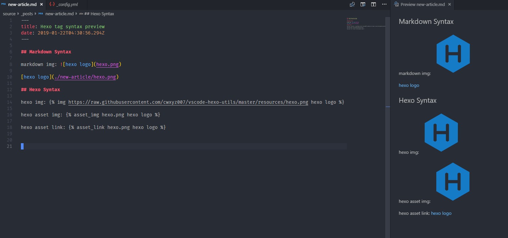

# VSCode Hexo Utils

A sidebar for [Hexo].

Open a [Hexo] project, and have fun.

## Features

- Sidebar, include tags, categories, posts and drafts
- Markdown preview
- Assets path completion
- Hexo tag syntax highlight and hexo snippets ([Markdown Snippet Prefix Does Not Trigger Snippet](https://github.com/Microsoft/vscode/issues/28048#issuecomment-306616235))
- Paste image directly from clipboard, default shortcut is `ctrl+alt+v`. (Thanks [vscode-paste-image] project)

## Extension Settings

- `hexo.sortMethod`: Controls posts(drafts) sorted method, default sort by name.
- `hexo.includeDraft`: Controls whether include drafts in tag and category view container, default `false`.
- `hexo.hexoProjectRoot`: `Hexo` project path(relative to current workspace root), default is workspace root.
- `hexo.markdown.resource`: Controls whether resolve image with hexo resource folder, default is `true`.
- `hexo.upload`: Controls whether upload image when use paste image command.
- `hexo.uploadType`: Only support 'imgchr'.
- `hexo.uploadImgchr`: Account settings for `https://imgchr.com/` site. Only available when `hexo.upload` is `true`.
- `hexo.generateTimeFormat`: The time format when generate new article, default is ISO format. ([time-format-tokens])

## Known Issues

[Bug report](https://github.com/cwxyz007/vscode-hexo-utils/issues/new?assignees=&labels=&template=bug_report.md&title=)

## Need Feature

[Feature require](https://github.com/cwxyz007/vscode-hexo-utils/issues/new?assignees=&labels=&template=feature_request.md&title=)

## Release Notes

See [CHANGELOG](CHANGELOG.md)

**Enjoy!**

[hexo]: https://hexo.io
[vscode-paste-image]: https://github.com/mushanshitiancai/vscode-paste-image
[time-format-tokens]: https://day.js.org/docs/en/plugin/custom-parse-format#list-of-all-available-format-tokens