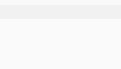

## Features

- Create new article with exists template
- Sidebar, include tags, categories, posts and drafts
- Preview image with assets folder
- Hexo tag syntax highlight and hexo snippets ([Markdown Snippet Prefix Does Not Trigger Snippet](https://github.com/Microsoft/vscode/issues/28048#issuecomment-306616235))
- Paste image directly from clipboard, default shortcut is ctrl+alt+v. (Thanks [vscode-paste-image] project)
- Support remote development
- And more ...

## Preview Image

image relative to assets folder

asset_path tag

asset_img tag



asset_link tag


